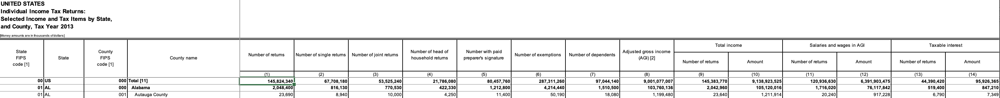

# Reproduction steps in Roundup

This workflow illustrates how a limitation of Roundup where the user has to manually fashion a join column. If Roundup supported joining on two columns, then the user would not have to create a combined FIPS code column in Excel before importing the data into Roundup. This workflow also illustrates how to use stack operations to trim down the number of columns in a dataset before materializing it.

## Pre-roundup steps

1. Fix nested headers: Open each of the 4 county filings spreadsheets for 2012-2015 in Excel. These sheets have nested headers and need to be modified in Excel so that the headers are in a single row.

2. Combine county fips code with state fips code in a new column to create a unique identifier for each column.

3. Export each sheet as a CSV

## Roundup steps

1. Import files into Roundup
2. Creat a stack opeaiton for each of the 4 years.
3. Trim the stack operation so only the firt five columns are included (out of 256)
4. Materialize stack operation
5. Join Bloomquist data on the combined FIPS code column, do a left join.
